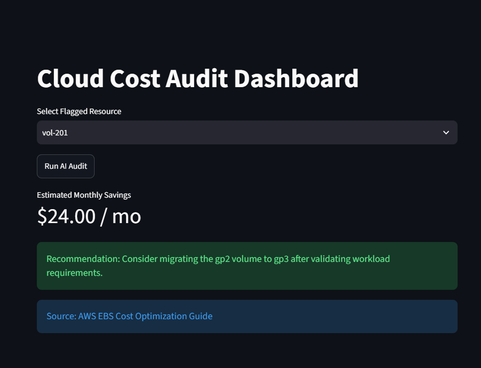
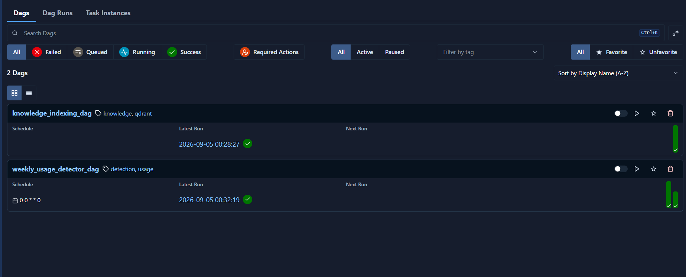
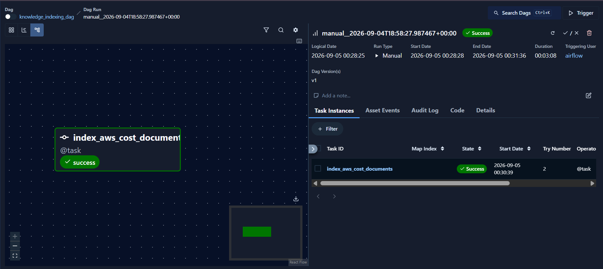
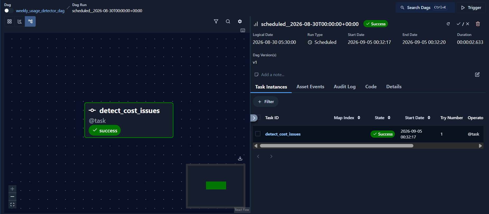
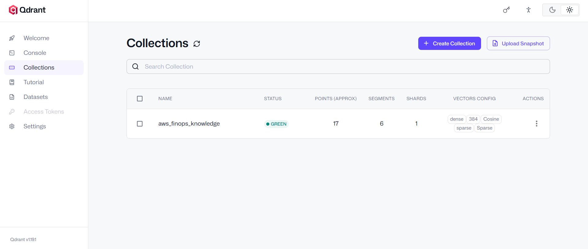
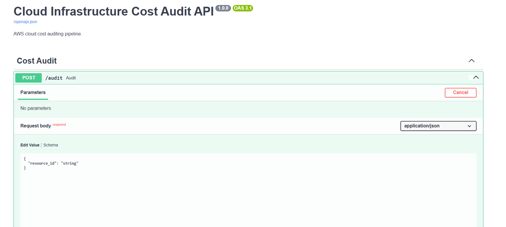

# Cloud Infrastructure Cost Audit Pipeline

## Project Overview

This project is a **beginner-friendly AI Engineering solution for AWS cloud cost auditing**.

The system analyzes an AWS infrastructure usage report, identifies common cost-related issues using simple Python/Pandas deterministic rules, and uses an LLM with RAG (Retrieval-Augmented Generation) to provide actionable recommendations for fixing those issues.

The project contains two main workflows:

1. **Cost Analysis** — Apache Airflow reads the AWS usage report from Amazon S3 and uses Python/Pandas to identify cost issues.
2. **AI Audit** — FastAPI receives a detected issue, searches AWS cost-optimization documents stored in Qdrant, and uses an LLM to generate a remediation recommendation.

The project uses **dense and sparse search together as a simple hybrid search approach**. Dense embeddings provide semantic matching, while sparse search helps match AWS-specific terms such as `gp2`, `gp3`, `EBS`, and `RDS`.

The AI audit uses **Server-Sent Events (SSE)** to stream progress updates such as `"Searching..."` and `"Generating recommendation..."`, and displays them on an interactive pure-Python **Streamlit dashboard**.

---

## Screenshots

### 1. Interactive FinOps Audit Dashboard (Streamlit)


### 2. Batch Pipeline Orchestration (Apache Airflow)


#### Knowledge Indexing DAG Task Run


#### Weekly Usage Detector DAG Task Run


### 3. Hybrid Search Vector Store (Qdrant)


### 4. Interactive API Documentation (FastAPI & Swagger UI)


---

## Architecture

```text
                     CLOUD COST AUDIT SYSTEM
                                │
               ┌────────────────┴────────────────┐
                 │                                 │
                 ▼                                 ▼
          KNOWLEDGE PIPELINE                 COST ANALYSIS
                 │                                 │
       AWS Cost Documents                  AWS Usage Report
                 │                                 │
                 ▼                                 ▼
             Amazon S3                         Amazon S3
                 │                                 │
                 ▼                                 ▼
      Knowledge Indexing DAG             Weekly Usage Detector DAG
                 │                                 │
                 ▼                                 ▼
         Text Processing                    Python / Pandas
                 │                                 │
                 ▼                                 ▼
       Dense + Sparse Search                Cost Issue Detection
                 │                                 │
                 ▼                                 ▼
              Qdrant                     detected_issues.json
                                                   │
                                                   ▼
                                             FastAPI Request
                                                   │
                                                   ▼
                                           Read Detected Issue
                                                   │
                                                   ▼
                                          Qdrant Hybrid Search
                                                   │
                                                   ▼
                                                  LLM
                                                   │
                                                   ▼
                                             Pydantic v2
                                                   │
                                                   ▼
                                             SSE Streaming
                                                   │
                                                   ▼
                                         Streamlit Dashboard
```

---

## Tech Stack

* **Language**: Python 3.11+
* **Frontend Dashboard**: Streamlit
* **Data Processing**: Pandas
* **API Framework**: FastAPI & Uvicorn
* **Schema Validation**: Pydantic v2
* **Orchestration**: Apache Airflow & Docker Compose
* **Cloud Storage**: Amazon S3 (`cloudfinops-data`)
* **Vector Database**: Qdrant (Hybrid Dense + Sparse)
* **Embeddings**: FastEmbed (`BAAI/bge-small-en-v1.5` dense + `Qdrant/bm25` sparse)
* **LLM**: OpenAI `gpt-4o-mini`
* **Real-time Updates**: Server-Sent Events (SSE)

---

## Project Structure

```text
cloudfinops/
│
├── airflow/
│   └── dags/
│       ├── knowledge_indexing_dag.py
│       └── weekly_usage_detector_dag.py
│
├── api/
│   ├── main.py
│   ├── routes/
│   │   └── audit.py
│   └── schemas/
│       └── audit.py
│
├── ingestion/
│   ├── document_parser.py
│   └── usage_parser.py
│
├── anomaly_detection/
│   └── detector.py
│
├── embeddings/
│   └── embedding_service.py
│
├── qdrant/
│   └── vector_store.py
│
├── search/
│   └── hybrid_search.py
│
├── llm/
│   └── audit_generator.py
│
├── data/
│   ├── documents/
│   └── usage_reports/
│
├── screenshots/
│   ├── streamlit_dashboard.png
│   ├── airflow_dags.png
│   ├── airflow_knowledge_dag.png
│   ├── airflow_detector_dag.png
│   ├── qdrant_dashboard.png
│   └── fastapi_docs.png
│
├── app.py
├── docker-compose.yaml
├── requirements.txt
└── README.md
```

---

## Cost Detection Rules

The usage detector Airflow DAG applies three deterministic rules:

1. **Rule 1 — Idle EC2**: `cpu_utilization < 5%` → `IDLE_RESOURCE`
2. **Rule 2 — Unattached EBS**: `days_unattached > 14` → `ORPHANED_STORAGE`
3. **Rule 3 — Large gp2 Volume**: `storage_type == 'gp2'` and `storage_size_gb > 500` → `LEGACY_STORAGE`

Output is saved to `anomalies/detected_issues.json`:

```json
[
  {
    "resource_id": "i-101",
    "resource_type": "EC2",
    "issue_type": "IDLE_RESOURCE",
    "monthly_cost": 85.0
  },
  {
    "resource_id": "vol-201",
    "resource_type": "EBS",
    "issue_type": "LEGACY_STORAGE",
    "monthly_cost": 120.0
  }
]
```

---

## FastAPI Audit Endpoint

### Request
```http
POST /audit
Content-Type: application/json

{
  "resource_id": "vol-201"
}
```

### SSE Progress Stream
```text
event: message
data: Retrieving detected issue...

event: message
data: Searching AWS policies...

event: message
data: Generating recommendation...

event: message
data: Validating response...

event: message
data: Audit completed.

event: result
data: {"status": "success", "audit": {"resource_id": "vol-201", "resource_type": "EBS", "issue_type": "LEGACY_STORAGE", "monthly_cost": 120.0, "recommendation": "Consider migrating the gp2 volume to gp3 after validating workload requirements.", "estimated_savings": 24.0, "source": "AWS EBS Cost Optimization Guide"}}
```

---

## Getting Started

### 1. Start Docker Infrastructure
```bash
docker compose up -d
```
- Airflow Web UI: `http://localhost:8080` (airflow / airflow)
- Qdrant Dashboard: `http://localhost:6333/dashboard`

### 2. Start FastAPI Server
```bash
uvicorn api.main:app --reload --port 8000
```
- API Docs: `http://localhost:8000/docs`
- Audit Endpoint: `POST http://localhost:8000/audit`

### 3. Start Streamlit Dashboard
```bash
streamlit run app.py
```
- Web UI: `http://localhost:8501`

